# Knowledge Base - Architecture Diagrams

## System Architecture Diagram

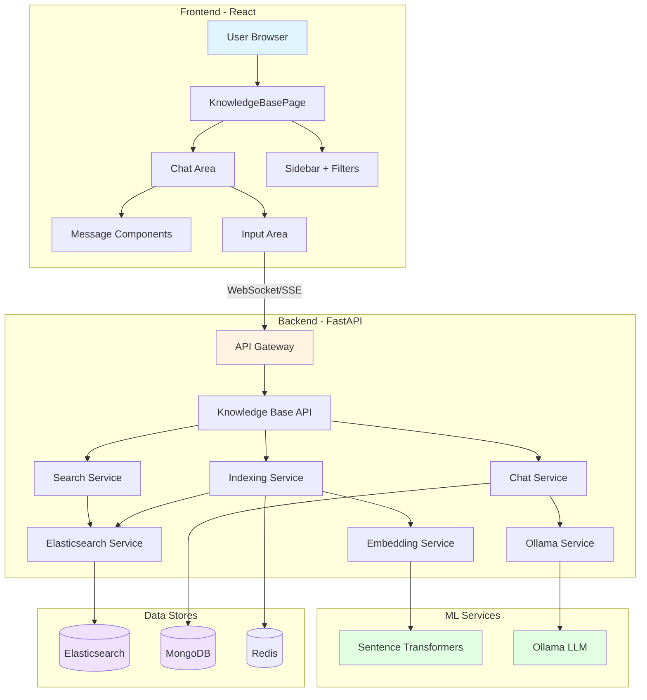

## Data Flow - User Query

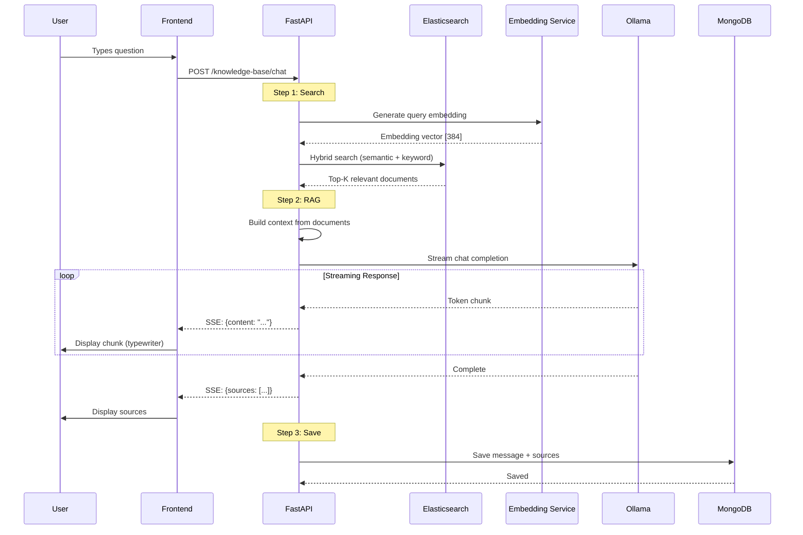

## Hybrid Search Flow

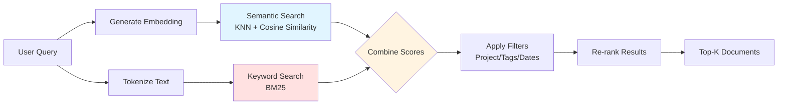

## Indexing Pipeline

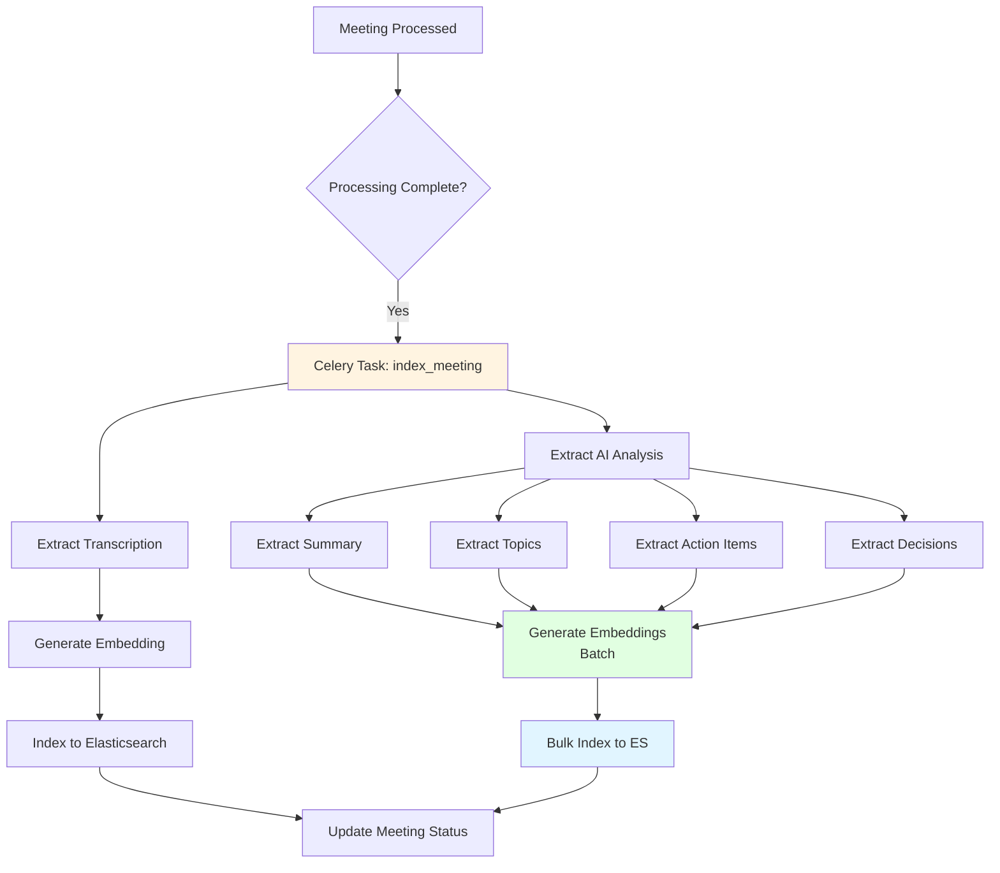

## Component Tree - Frontend

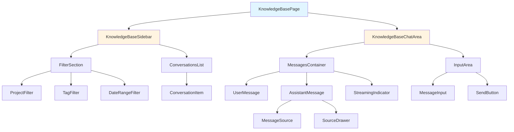

## Database Schema

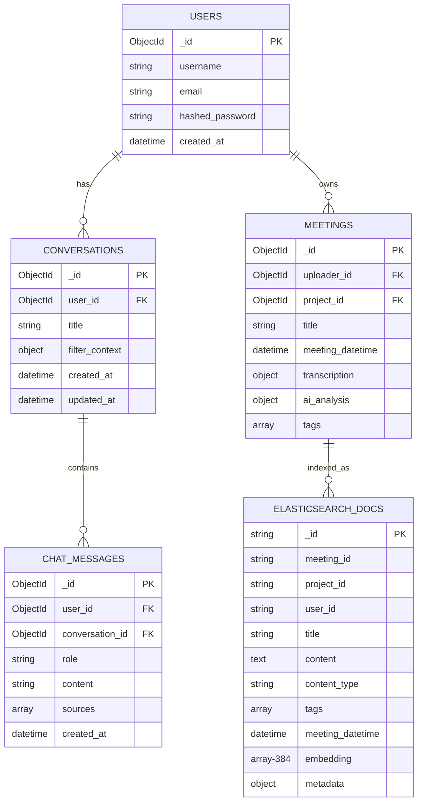

## State Management - Frontend

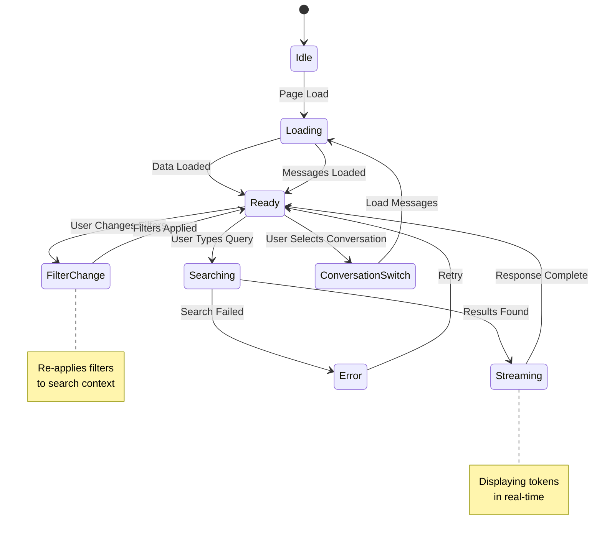

## API Endpoints Structure

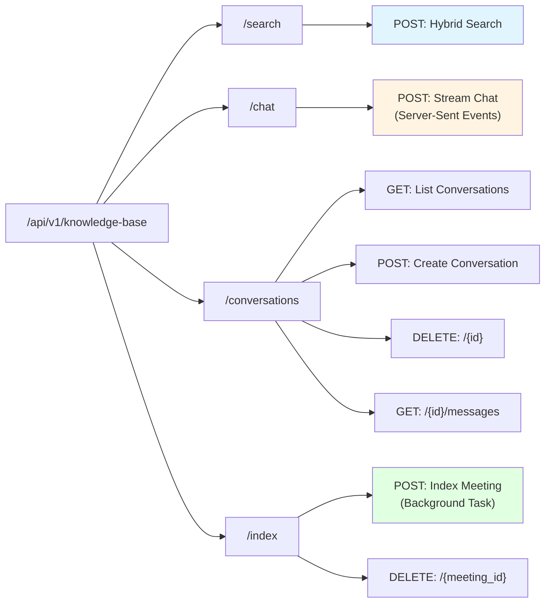

## Elasticsearch Index Structure

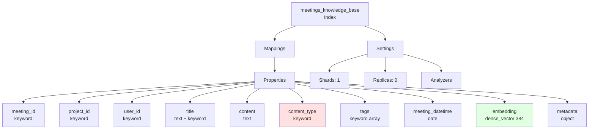

## Performance Optimization Flow

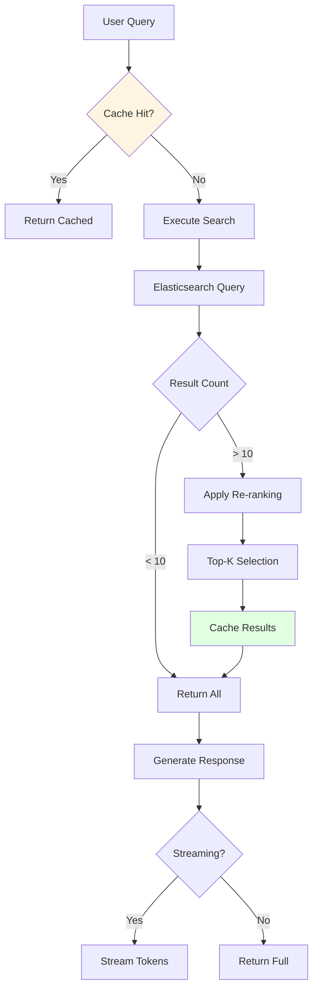

## Security & Auth Flow

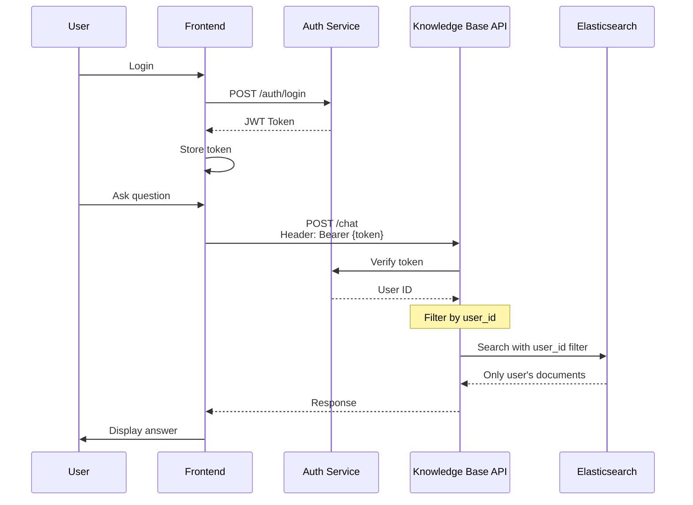

## Deployment Architecture

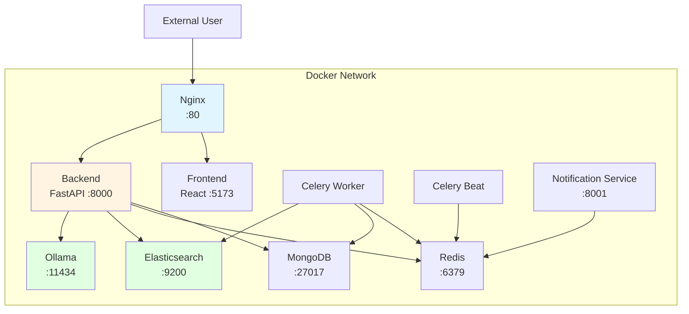

## Testing Strategy

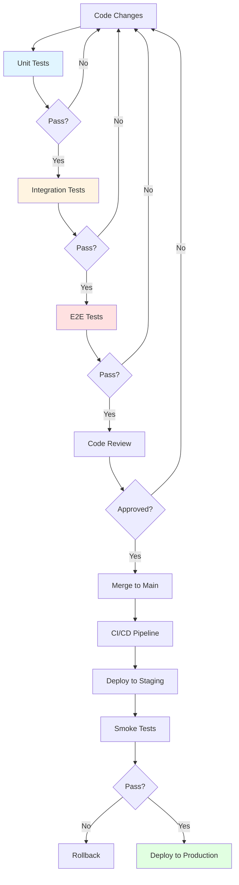

---

## How to Use These Diagrams

### In Documentation

Copy the Mermaid code blocks into Markdown files. GitHub and many Markdown viewers render them automatically.

### In VS Code

Install the "Markdown Preview Mermaid Support" extension to preview diagrams.

### Online Editor

Use [Mermaid Live Editor](https://mermaid.live/) to edit and export as PNG/SVG.

### In Presentations

Export as images and use in slides or documentation.

---

**Document Version**: 1.0  
**Last Updated**: 2025-11-01  
**Tools**: Mermaid.js for diagram generation
